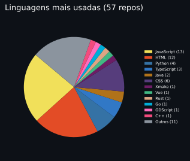
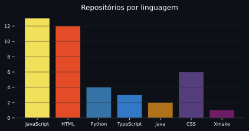

<h1 align="center">Olá! Eu sou o Bryan 👋</h1>

  
  
  
  

 Desenvolvedor de software · jogos · ferramentas · web 

---

### 📊 Estatísticas públicas

  

  

  

### 🌱 Linguagens & tecnologias

  
  
  
  
  
  
  
  
  

### 🧩 Projetos em destaque

<table>
  <tr>
    <td align="center"><b>🌐 Synca</b> Sincronizador de arquivos locais (Go)</td>
    <td align="center"><b>⚙️ Delta.tools</b> Conversor de arquivos (JavaScript)</td>
  </tr>
  <tr>
    <td align="center"><b>📱 RePlace</b> App mobile React Native (TypeScript)</td>
    <td align="center"><b>🎮 StremioRPC</b> Discord RPC para Stremio (JavaScript)</td>
  </tr>
  <tr>
    <td align="center"><b>🕹️ Gravitris</b> Releitura de Tetris (JavaScript)</td>
    <td align="center"><b>🧩 ReplicubeModLoader</b> Mod loader (JavaScript)</td>
  </tr>
</table>

<i>Nota: se um repositório não está na lista de "destaques", veja todos: <a href="https://github.com/bryanrafaelbueno?tab=repositories">github.com/bryanrafaelbueno</a></i>

